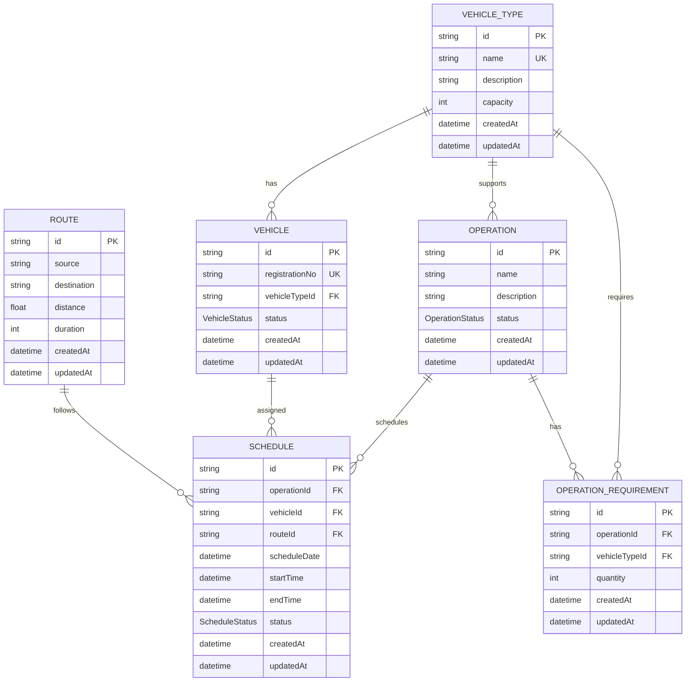

# vehicle-operations-api

```mermaid
erDiagram
    VEHICLE_TYPE ||--o{ VEHICLE : has
    VEHICLE_TYPE ||--o{ OPERATION : supports
    VEHICLE_TYPE ||--o{ OPERATION_REQUIREMENT : requires
    OPERATION ||--o{ OPERATION_REQUIREMENT : has
    OPERATION ||--o{ SCHEDULE : schedules
    VEHICLE ||--o{ SCHEDULE : assigned
    ROUTE ||--o{ SCHEDULE : follows

    VEHICLE_TYPE {
        string id PK
        string name UK
        string description
        int capacity
        datetime createdAt
        datetime updatedAt
    }

    VEHICLE {
        string id PK
        string registrationNo UK
        string vehicleTypeId FK
        VehicleStatus status
        datetime createdAt
        datetime updatedAt
    }

    OPERATION {
        string id PK
        string name
        string description
        OperationStatus status
        datetime createdAt
        datetime updatedAt
    }

    OPERATION_REQUIREMENT {
        string id PK
        string operationId FK
        string vehicleTypeId FK
        int quantity
        datetime createdAt
        datetime updatedAt
    }

    ROUTE {
        string id PK
        string source
        string destination
        float distance
        int duration
        datetime createdAt
        datetime updatedAt
    }

    SCHEDULE {
        string id PK
        string operationId FK
        string vehicleId FK
        string routeId FK
        datetime scheduleDate
        datetime startTime
        datetime endTime
        ScheduleStatus status
        datetime createdAt
        datetime updatedAt
    }
```
